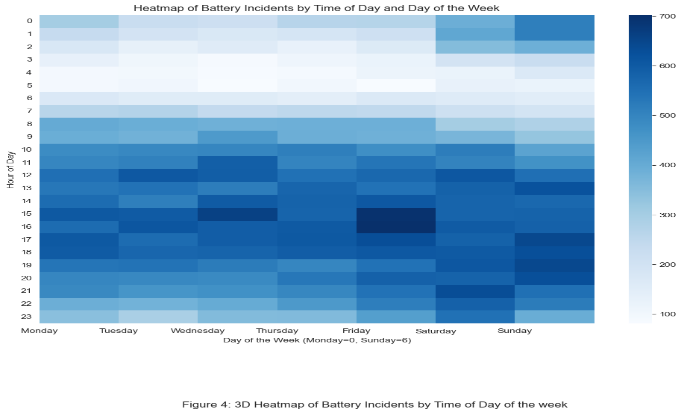
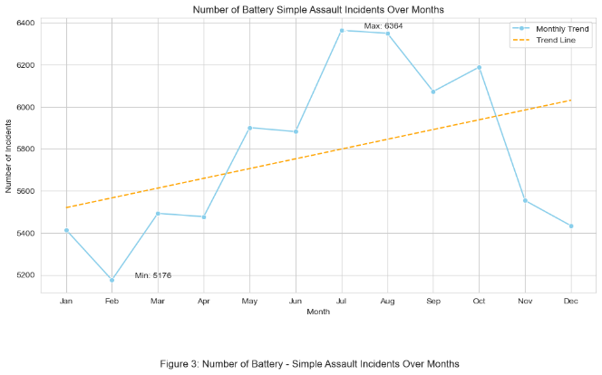
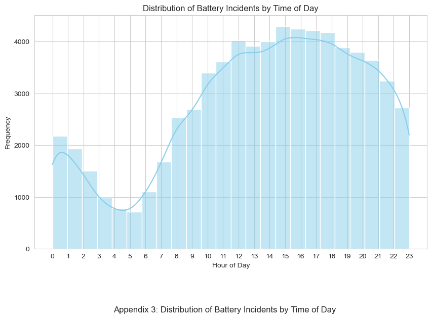
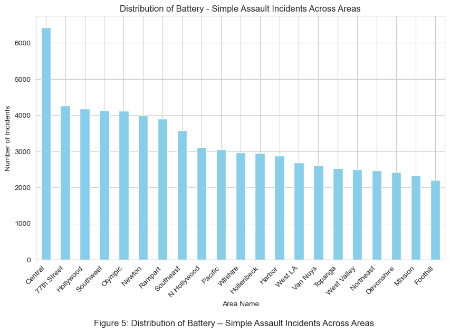
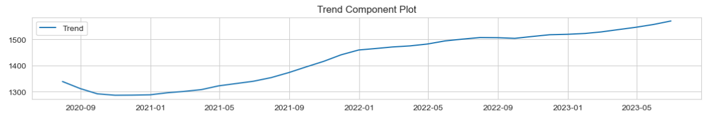
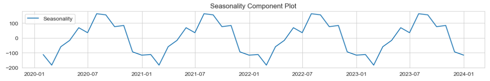
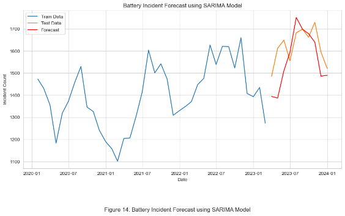
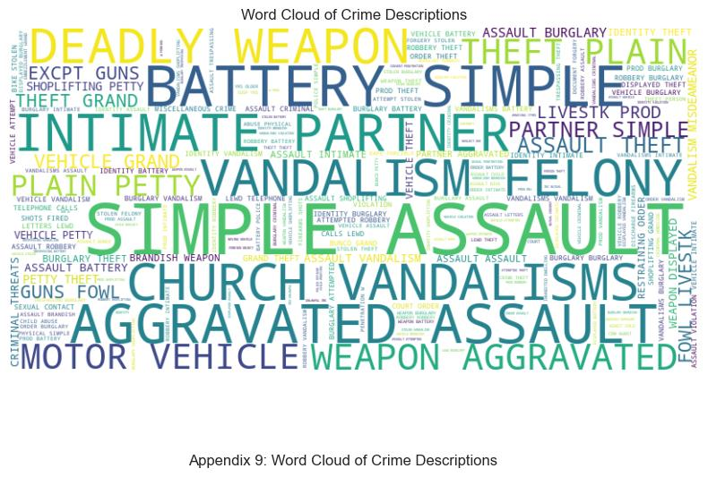

# 🚓 Los Angeles Crime Patterns & Forecasting

Exploratory analysis and time-series forecasting of **~897,000 crime records** (29 features) from the Los Angeles Police Department's open data, 2020 to early 2024. The analysis focuses on battery and simple assault, the most common violent-crime category. It looks at **when, where and how** incidents happen, then forecasts monthly volumes with **SARIMA** to support police staffing and resource planning.

**Tools:** Python · pandas · Matplotlib · Seaborn · statsmodels (seasonal decomposition, SARIMA) · sentiment analysis · word clouds · geospatial mapping

**Data:** [Crime Data from 2020 to Present, LA Open Data](https://data.lacity.org/Public-Safety/Crime-Data-from-2020-to-Present/2nrs-mtv8)

---

## Key findings

| Finding | Detail |
|---|---|
| 📈 **Rising trend** | Battery / simple assault reports rose from ~16,000 in 2021 to **~18,900 in 2023** |
| ☀️ **Summer peak** | **July** is the worst month (6,364 incidents) and **February** the quietest (5,176), a 23% swing |
| 🕒 **Afternoon peak** | Incidents peak at **3–6 pm**, are lowest around **5 am**, and spike on **weekend late nights** |
| 📍 **Hotspots** | **Central** division leads (6,429 incidents), followed by **77th Street** (4,273) |
| 🏠 **Where it happens** | The top locations are single-family homes, streets and multi-unit housing |
| ✊ **Weapon** | "Strong-arm" (hands, fists, feet) in **62,565** incidents, more than 10× the next category |
| ⏱️ **Reporting delay** | Victims take **2.6 days** on average to report, so there's room for earlier reporting |

## When does it happen?

The hour × weekday heatmap shows weekday afternoons and **weekend late nights** as the riskiest windows. This is directly useful for scheduling patrol shifts.

  
  

## Where does it happen?

## Forecasting with SARIMA

The monthly series was split into **trend** and **seasonal** components, then a SARIMA model was trained on the first 80% of months and tested on the last 20%.

  
  

The forecast (red) tracks the mid-2023 summer surge and the autumn decline in the held-out data (orange):

## Text analysis of crime descriptions

A word cloud of incident descriptions shows simple assault, vandalism, intimate-partner violence and theft as the dominant themes. Sentiment scoring confirmed that most police descriptions are written in a neutral tone.

---

## Ethics

Crime data contains sensitive information about victims. The analysis uses only the anonymised public release, reports aggregates rather than individuals, and treats demographic patterns with care. They describe reported incidents, not underlying risk, and can reflect biases in policing and reporting.

## What I'd do next

- Compare SARIMA with Prophet and gradient-boosted models, and report MAE/MAPE alongside MSE so errors are easy to interpret.
- Build an interactive Power BI or Streamlit dashboard so area commanders can filter by division, hour and crime type.
- Add external drivers (temperature, holidays, major events) to explain the summer peak.

---

*Built for the Data Visualisation module of my MSc Big Data Analytics, University of Derby, 2024.*
